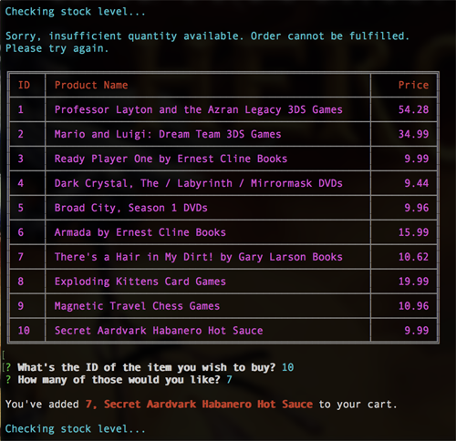
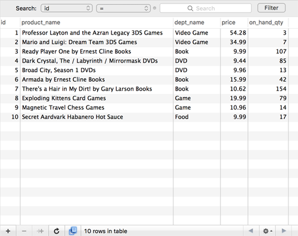

<h1 align="center">Bamazon</h1>

Command-line storefront application integrating a MySQL database

## Contents

- [Concept](#concept)
- [Technologies Used](#technologies-used)
- [Key Features](#key-features)
- [Application Video](#application-video)
- [Screenshots: "bamazonCustomer" View](#screenshots-bamazoncustomer-view)
  - [Step-by-step screens](#step-by-step-screens)
    - [First view ~ Welcome and Products Table](#first-view-welcome-and-products-table)
    - [Second view ~ Cart and In-Stock Process](#second-view-cart-and-in-stock-process)
    - [Continue Shopping ~ Yes](#continue-shopping-yes)
    - [Out-of-Stock Process](#out-of-stock-process)
    - [Final View ~ Order Successful, End Shopping](#final-view-order-successful-end-shopping)
    - [Database Inventory View Before Sales](#database-inventory-view-before-sales)
    - [Database Inventory View After Sales](#database-inventory-view-after-sales)

## Concept

A command-line storefront application integrating a MySQL database to track and update stock quantities of available products. Friendly messages alert the customer key information about their transactions.

## Technologies Used

MySQL, Node.js, JavaScript, and the packages NPM MySQL, Inquirer, Colors.js & CLI-Table

## Key Features

- Check for sufficient stock level before completing purchase process
- Table view of products for sale

### Application Video

[Video of application in action][2c341124]

  [2c341124]: https://github.com/g33klaura/bamazon/blob/master/screenshots/bamazonCustomer_view.mov "Process Video"

### Screenshots: "bamazonCustomer" View

- View of successfully processed order (entire process)

------
### Step-by-step screens
* User types 'node bamazonCustomer.js' to initialize the program

#### First view ~ Welcome and Products Table

  * Table displays available products by their id, product name, and retail price
  * User is prompted to enter an id and qty of an item they wish to purchase

#### Second view ~ Cart and In-Stock Process

  * Items and quantity the user selected are logged
  * A function is triggered to check if there's enough stock of the item to complete the purchase
  * If there is enough stock on hand, a "success" message is logged
  * Next, a "receipt" is generated, totaling the cost of the items and thanking the user
  * When the quantity is successfully deducted from the database, "order successful" logs
  * Finally a new prompt asks the user if they'd like to continue shopping

#### Continue Shopping ~ Yes

  * Confirming "yes" triggers the product display table and initial purchase prompts

#### Out-of-Stock Process

  * If the user enters a quantity that is out of stock, a message is logged that the "order cannot be fulfilled"
  * The product display table is triggered again

#### Final View ~ Order Successful, End Shopping

  * After another successful order, the user is again asked if they'd like to continue shopping
  * Confirming "no" logs a message to "have a great day"

#### Database Inventory View Before Sales

#### Database Inventory View After Sales

  * The quantity of items from the examples have been deducted successfully

------
_Thanks for reading. Happy shopping!_
