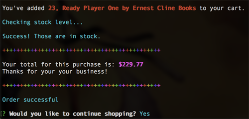
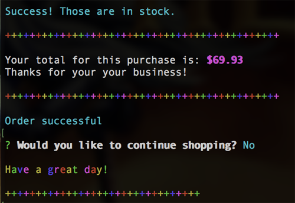

# bamazon

CLI storefront integrating a MySQL database

These are a few of my favorite things (to buy... if I had all the $$$...)

## Technologies Used
JavaScript, Node.js, MySQL, and MySQL, Colors.js & CLI-Table packages

## Application Video
[Video of application in action][2c341124]

  [2c341124]: https://github.com/g33klaura/bamazon/blob/master/screenshots/bamazonCustomer_view.mov "Process Video"

## Process Screenshots for "bamazonCustomer" View

* View of successfully processed order (entire process)

------
### Step-by-step screens
* User types 'node bamazonCustomer.js' to initialize the program

### First view ~ Welcome and Products Table

  * Table displays available products by their id, product name, and retail price
  * User is prompted to enter an id and qty of an item they wish to purchase

### Second view ~ Cart and In-Stock Process

  * Items and quantity the user selected are logged
  * A function is triggered to check if there's enough stock of the item to complete the purchase
  * If there is enough stock on hand, a "success" message is logged
  * Next, a "receipt" is generated, totaling the cost of the items and thanking the user
  * When the quantity is successfully deducted from the database, "order successful" logs
  * Finally a new prompt asks the user if they'd like to continue shopping

### Continue Shopping ~ Yes

  * Confirming "yes" triggers the product display table and initial purchase prompts

### Out-of-Stock Process

  * If the user enters a quantity that is out of stock, a message is logged that the "order cannot be fulfilled"
  * The product display table is triggered again

### Final View ~ Order Successful, End Shopping

  * After another successful order, the user is again asked if they'd like to continue shopping
  * Confirming "no" logs a message to "have a great day"

### Database Inventory View Before Sales

### Database Inventory View After Sales

  * The quantity of items from the examples have been deducted successfully
------
_Thanks for reading!_
